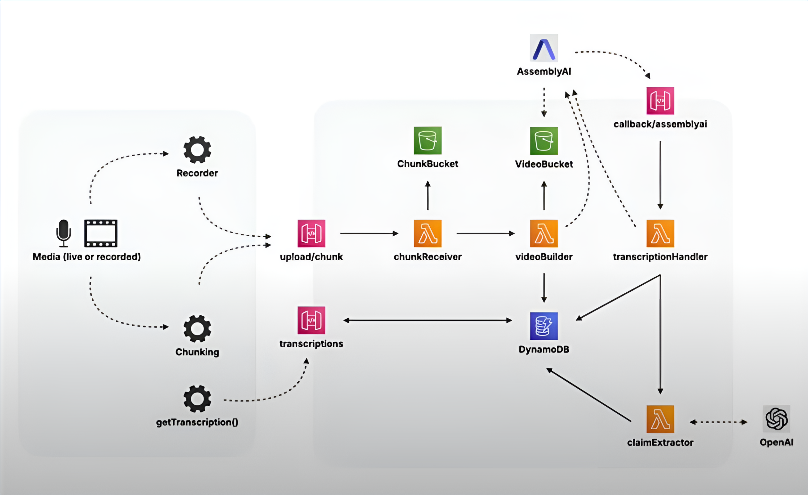

# Nirnay - Fake news detection in live broadcasts

## Overview
**Nirnay** is an AI-powered pipeline for detecting misinformation in live broadcasts. It extracts text from live video feeds, analyzes claims using NLP, and fact-checks them in real time.

## Features
- 🎥 **Live Video Processing** - Converts YouTube/live video to text using FFMPEG & Whisper.
- 🔎 **Misinformation Classification** - Uses a DistilBERT-based NLP model.
- ✅ **Fact-Checking** - Integrates Google Fact Check API.
- 📊 **Real-Time Dashboard** - Built with Streamlit & Plotly.
- 📝 **Summary Generation** - Uses GPT/T5 to summarize findings.

## Workflow

Below is the workflow for **Nirnay**, illustrating the process of extracting, analyzing, and fact-checking claims from live video streams.



## Installation

### 1️⃣ Setup Virtual Environment

```sh
python3 -m venv ~/env
source ~/env/bin/activate
```
### 2️⃣ Install Dependencies
```sh
pip install -r requirements.txt
```
### 3️⃣ Run the App
```sh
streamlit run client/app.py
```

## Usage
1. **Provide a YouTube Live link** or select a sample video.
2. **Monitor real-time claims** detected in the broadcast.
3. **View fact-checked results** with verified sources.
4. **Summarized insights** displayed for quick analysis.

## Technologies Used
- **Python 3.11**
- **FFMPEG + Whisper AI** (Speech-to-Text)
- **Hugging Face Transformers** (DistilBERT for claim detection)
- **Google Fact Check API** (Fact verification)
- **Streamlit & Plotly** (Dashboard visualization)

## Future Enhancements
- 🛠️ **Multi-language support** for misinformation detection.
- 🚀 **Enhanced claim verification** using multiple sources.
- 📡 **Social media integration** for wider tracking.

## License
This project is licensed under the MIT License.
